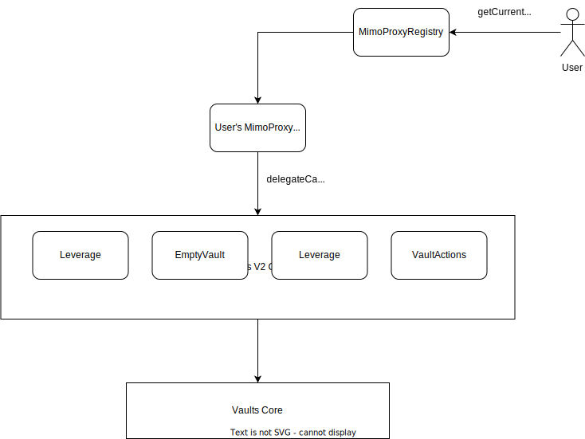
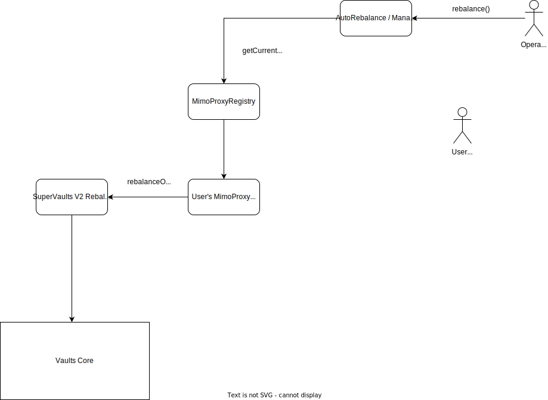

# Content

- [Differences from SuperVaults V1](#differences-from-supervaults-v1)
- [Example Use Cases](#example-use-cases)
  - [Automated Vaults](#automated-vaults)
    - [Automated Vault Config](#automated-vault-config)
  - [Managed Vaults](#managed-vaults)
    - [Managed Vault Config](#managed-vault-config)
- [Technical Specifications](#technical-specifications)
  - [Proxy Design](#proxy-design)
  - [Creating a Proxy](#creating-a-proxy)
  - [Basic Vault Operations](#basic-vault-operations)
  - [Managed & Automated Rebalance Vault Operations](#managed--automated-rebalance-vault-operations)
  - [Rebalance paramater Equation Calculation](#rebalance-paramater-equation-calculation)
  - [Known Limitations](#known-limitations)
    - [Non supported token](#non-supported-tokens)
    - [Non performanced based fees](#non-performanced-based-fees)
    - [User interferance](#user-interferance)
  - [Non gas optimized syntax](#non-gas-optimized-syntax)
    - [For loop syntax](#for-loop-syntax)
    - [Value comparision](#value-comparision)

# SuperVaults V2

SuperVaults V2 enables any user to deploy their own proxy contract to extend the functionality of the Mimo protocol. This opens users up to do complicated vault operations such as:

- All `vaultsCore` operations through `delegateCall`s
- Leveraging collateral to be more sensitive to price movements
- Rebalancing collateral between vaults without additional capital
- Repaying a vault's debt using the collateral and withdrawing leftover collateral
- Delegating control for anyone to rebalance one's vaults to avoid liquidation, with restrictions to preserve the value held in the vault
- Delegating control to a manger to rebalance one's vaults based on future market predictions, with restrictions to preserve the value held in the vault

# Differences from SuperVaults V1

Supervaults V2 expand on the features of SuperVaults V1 to securely allow owners to give control of their vaults to others to do vault operations on their behalf. This is useful for users who don't have enough time or knowledge to manage their own vaults, and creates profit opportunities for vault operators to maximize collateral value of the protocol, in turn maximizing overall protocol health. In a nutshell, SuperVaults V2 brings the following changes from V1:

- The user-deployed MIMOProxy now uses a similar design to MakerDAO's and DefiSaver's `DSProxy`. This enables flexibility in making any proxy call instead of limiting users to cloning a fixed contract with all logic in it. See `proxy design` section.
- Managed Vaults Feature: Allow users to chose from whitelisted addresses to rebalance their vaults within a given config. These addresses are not limited to EOAs and thus can be smart contract (e.g. DAOs).
- Automated Vaults Feature: Allow anyone to rebalance vaults to meet a user-specified collateralization ratio if a vault is past a user-specified trigger collateralization ratio

# Example Use Cases

Supervaults V1 enabled the basic supervault operations (leverage, rebalance, emptyvault). Though it is straightforward for most users to know when they should leverage (e.g. when they are very bullish on an asset) and when they should empty their vault (e.g. when they need to withdraw their capital out of the protocol), knowing when to rebalance and what collaterals to rebalance to requires sufficient knowledge of the market conditions, and thus can be too laborious or complicated of a feature for many users of the protocol to take full advantage of. SuperVaults V2 aims to solve this problem through allowing users to securely delegate management of their rebalance calls to other users of the protocol.

To do this securely, all features that allow users to delegate rebalance calls enforce sanity checks to protect users from high slippage and unhealthy vault positions.

## Automated Vaults

For our example use case, let's assume we want to open up a vault with WETH as the collateral. We're not confident enough in ourselves to stay up-to-date with market conditions to know when we should move to less volatile collateral to avoid liquidations. To incentivize others to rebalance on our behalf within specific parameters, we use `automatedVaults`. SuperVaults v2 enforces checks to avoid the risks of users abusing their ability to rebalance others' vaults (e.g. enforcing rules on the collateralization ratio that a vault must be at to be rebalanced, enforcing a maximum change in vault value from the rebalance, and enforcing limits on how many rebalances can be done within a time period). A user can specify how much fees they want to pay to the user (both flat fees per rebalance `fixedFee`s per rebalance, and `varFee`s depending on the amount rebalanced) to incentivize others and to rebalance and to offset any gas costs of calling the rebalance function on their behalf.

### Automated Vault Config

To open our vault up for `autoRebalance`s, we must first call the `setAutomation` function on the `MIMOAutoRebalance` contract through the `MimoProxy` clone. In addition to the `vaultId` of the vault to rebalance, the `setAutomation` takes the following config argument:

```
 struct AutomatedVault {
   bool isAutomated;
   uint256 allowedVariation;
   uint256 targetRatio;
   uint256 triggerRatio;
   uint256 mcrBuffer;
   uint256 fixedFee;
   uint256 varFee;
 }
```

The default state for V2 SuperVaults starts with `isAutomated` set to `false` - which corresponds to a state of the vault not being open to automation. To open the vault up for automation by anyone, `isAutomated` will need to be set to `true`.

Each rebalance call will swap one collateral for another. To impose maximum slippage amounts to ensure our vault collateral doesn't lose too much value in between rebalances, we can set the `allowedVariation`. The variation is calculated as:
`vaultVariation = (intended rebalance collateral value - received swapped collateral value)/(starting vault Value)`

Each automated rebalance will move the collateral and debt from the starting vault to a vault with less volatile collateral to bring the starting vault's collateralization ratio to the given `targetRatio`. Operators can only rebalance if the vault's collateralization ratio is lower than the `triggerRatio`. Given this `targetRatio` and `triggerRatio`, we can find the `rebalanceAmount` and `mintAmount` needed to make this rebalance call through assuming that we will borrow as much debt as the protocol allows us to (padded by the `mcrBuffer`). The full derivation is shown in the `Automated Rebalance Calculation` section.

The automated rebalance calculates the amount of collateral and debt to rebalance based on the `mcrBuffer` padding specified by the user. A higher `mcrBuffer` means the collateral moved to the vault with less volatile collateral will be healthier after the rebalance, though it will also require more collateral and par debt to be moved from the starting vault to reach this padding. Each `autoRebalance` will withdraw just enough PAR to keep the to vault at this collateralization ratio.

Users can configure how much they want to pay to incentivize each `autoRebalance` through setting the `fixedFee`, and `varFee`. The total fees paid per each rebalance is given as:  
 `( total fees ) = fixedFee + (varFee * rebalanceValue)`

Where `rebalanceValue` is the value, in PAR, of the `rebalancedCollateral`. Rebalancing fees are paid in PAR borrowed from the vault that is rebalanced to.

Setting higher fees incentivizes more people to monitor a vault for rebalances, but makes each rebalance more costly.

To avoid substantial loss of collateral through multiple rebalances, supervaults v2 limits the amount of auto rebalances on any vault to one per day.

## Managed Vaults

The automated vault config imposes enough restrictions to allow users to be confident that each automated rebalance is done sensibly and doesn't cost the user too much in slippage and rebalance fees. Though this constraint is good when allowing anyone to rebalance on our behalf, this doesn't allow for more profitable strategies. For example,  
if we wanted to trust someone to make arbitrary calls on our collateral based on their future predictions of collateral value, we could use `ManagedVaults` to give more control of our rebalance calls to a whitelisted manager address.

### Managed Vault Config

Similar to calling `setAutomation` for an `AutomatedVault`, users configure a vault to be managed through calling the `setManagement` function. Along with the `vaultId`, the `setManagement` function takes the following config as an argument:

    struct ManagedVault {
      bool isManaged;
      address manager;
      uint256 allowedVariation;
      uint256 minRatio;
      uint256 fixedFee;
      uint256 varFee;
      uint256 mcrBuffer
    }

The default state for our V2 SuperVault starts with `isManaged` set to `false` - which corresponds to a state of the vault not being open to management. To open the vault up for management, `isManaged` will need to be set to `true`.

To set the address of the manager, change the `manager` property. This address must be a whitelisted vault manager address on the protocol.

The `allowedVariation` is calculated similarly as in automatedVaults, and limits the amount that the `vaultValue` can change over a single rebalance.

The `minRatio` is the minimum collateralization ratio above which the starting vault must be at the end of the rebalance.

The `fixedFee` and `varFee` are similar to to the `fixedFee` and `varFee` in the `AutomatedVault` - the total fee is paid out to each operator on a successful rebalancing:

`(total paid out) = fixedFee + (varFee * rebalanceValue)`

The `mcrBuffer` is the addtional percentage of collateral to debt ratio padding the minimum collateral ratio of the vault that the manager is rebalancing to. This protects users from having their `toCollateral` vaults being maxed out and running the risk of liquidation.

# Technical Specifications

## Proxy Design

Supervaults V2 uses a proxy pattern to allow users to make proxy calls on behalf of other users, and interact with multiple contracts (e.g. the Mimo core protocol, dex aggregators, flashloan protocols) within a single transaction. The proxy pattern also allows for integrating with external contracts (e.g. lending pools and dex aggregators) to do complicated on-chain vault operations while still maintaining the correct access control to access `vaultsCore`.

Note: Supervaults V2 uses a significantly different design pattern than v1 to allow users to delegate access to their supervaults to do operations and modularize code to allow for efficient inheritance.

Though the design was based largely off of [PRB Proxy pattern](https://github.com/paulrberg/prb-proxy), there are a few differences:

- MIMOProxy uses implements EIP-1167 through the Openzepplin Clones library in the MIMOProxyFactory to save gas on deployment. Though this increases the gas cost on each call by about 2700 gas, it saves about 400k gas per deployment.
- PRBProxyFactory uses CREATE2 opcode to deploy proxies at deterministic addresses while MIMOProxyFactory does not. This was done to save gas and because we don't need to deploy proxies at deterministic addresses.
- MIMOProxy uses of BoringBatchable in the MIMOProxy to perform batch delegate calls to address(this). This is useful for chaining calls to owner protected functions like setPermission() and execute() to save user transactions.
- A multicall function in the MIMOProxy to batch regular calls (e.g. for interactions with VaultsCore or future custom logic we could implement, such as borrowing PAR and staking in PARMiner in a single transaction). Paired with BoringBatchable, we can also perform calls to SuperVaults v2 action contracts and to regular protocol contracts in a single transaction.

### Creating a Proxy

Users create a proxy by calling `deploy()` on the `MimoProxyRegistry` contract, which creates a clone of the `MimoProxy` for the user:


The proxy registry ensures that only one proxy can exist per owner at a time. The `MimoProxyRegistry` should be queried using `getCurrentProxy()` before any proxy call to get the most recent proxy address for a particular user.

## Basic Vault Operations

With this design pattern, all collateral is held by the `MimoProxy` clone for the user, and the the `MimoProxy` clone is the owner of vaults on `VaultsCore`. All vault operations are done through an intermediate call through the SuperVaults V2 contracts through `delegateCall`

.

Because `VaultsCore` enforces that only the vault's creator can do vault operations, all vaults that intend to do any operations through the `MimoProxy` must be created by the `MimoProxy` for the right access control. Each vault operation in SuperVaults V2 has its own contract instance associated with it.

## Managed & Automated Rebalance Vault Operations

In addition to the base access control for all vault operations, Managed and Automated rebalance calls require enforcing that all rebalances meet the `ManagedVault` and `AutomatedVault` configs. Moreover, `rebalance()` calls for these contracts should be open to not just the vault owner to allow others to rebalance as well. Thus, calls for managed and auto rebalancing use slightly different interactions than having users directly interact with the MimoProxy clone for the user. Instead, `rebalance()` calls for `ManagedVault`s and `AutomatedVault`s must be directly made through the corresponding `MIMOAutoRebalance` or `MIMOManagedRebalance` contracts. From there, any pre-rebalance checks are done (e.g. if the caller is a manger for a `ManagedRebalance`) before calling the `execute()` method for the `MimoProxy` clone, which makes a regular `rebalance()` call to the `rebalance` SuperVaults V2 contract (as in the case for a normal rebalance). Before ending the transaction, the post-rebalance checks (e.g. making sure `vaultVariation` is within the limits) are done.  
 

## Rebalance paramater Equation

Let's assume we we have an `automatedVault` called `vaultA` that has reached the `triggerRatio`. This vault can be rebalanced to meet a `targetRatio` by moving some collateral and debt to another vault (let's call this `vaultB`) with a lower MCR, but we must find the `rebalanceAmount` (the amount of collateral to balance) and `mintAmount`(the amount of vault debt to rebalance) to specify the rebalance transaction. To find out how much collateral and vault debt corresponds to moving a vault from a `triggerRatio` to a `targetRatio` collateralization ratio, we first start with the equation for the health ratio on vault A:

```
(1) (startingCollateralAmount - rebalanceAmount) * (collateralAPARPrice) / (startingVaultDebt - rebalancedVaultDebt) >= MCR
```

Since we have two variables we're solving for, we need two equations. Though we can come up with a similar equation for the vault we are rebalancing to (i.e. `vaultB`), this equation is the same as above equation, so we must find another equation to solve for to get the two unknowns.  
We get the second equation through assuming that we withdraw as much collateral from vaultB as the protocol allows us, padded by some `mcrBuffer` and enough to pay the fixed and variable rebalancing fees :

```
(2) mintAmount + fixedFee + (variableFee * rebalanceAmount * collateralBPARPrice) = (rebalanceAmount) * (collateralBPARPrice) / (MCRB + mcrBuffer)
```

Now we can solve for the `rebalanceAmount` and `mintAmount` using equations `(1)` and `(2)` to get:

```
rebalanceAmount =
 (targetRatio * (vaultADebt + fixedFee) - vaultACollateralValue) /
 (targetRatio / (vaultBMcr + mcrBuffer) - targetRatio * varFee - 1);
```

## Known Limitations

### Non supported tokens

- This code is only meant to work with ERC20 that would be sensibly accepted by the MIMO governance:
  - All ERC20 tokens in all contracts have an accuracy of no more than 18 decimals
  - No fee-on-transfer tokens are supported (i.e. the full amount of any ERC20 token transfers will go to the receiver)
  - Approve 0 tokens like USDT are not supported
  - Deflationnary tokens are not supported

### Non performanced based fees

Manged vaults assume that the manager can be trusted as a rebalancer. The fee model in itself has some limitations as it is not performance based and managers could technically grief the user by repeatedly rebalancing small amounts to take a user's `fixedFee` for each rebalance. Rebalance frequency limitation helps mitigate this along with the fact that managers should be added by the governance and can also be removed. Users can also at any moment remove their vault from management.

### User interferance

With current design users can still execute operations on their managed vault and could technically get in the way of managers' srategies. User interferance prevention will be done at the front end level as this feature will most likely be used by non technical users. Also managers are free to chose to manage a vault or not and interfering with managers' strategies will most likely lead to a user vault being dropped from management.

## Non gas optimized syntax

The following should not be considered as a Gas Optimisation issue.

### For loop syntax

Non gas optimized for loop syntax :

```
for (uint256 i = 0, i < a, i++) {
  /// ...
}
```

Gas optimized for loop (for solidity version < 0.8) :

```
for (uint256 i, i < a;) {
  /// ...
  unchecked { ++i }
}
```

**Giving that our codebase never loops over very large data structures we favor readibility over gas saving and thus use the non gas optimized syntax.**

Also, when using the length of a storage array as the condition being checked after each loop, it is often mentionned that caching the array length in memory can yield significant gas savings if the array length is high. This optimization is actually done by the Yul optimizer as mentionned [here](https://blog.soliditylang.org/2020/11/04/solidity-ama-1-recap/). **Hence we do not use variable caching for loop length.**

### Value comparision

`!= 0` over `> 0` :

We recognize that in a conditional context, using the construction `var != 0` costs less gas than using `var > 0` (about 6 gas saved). However, this syntax should be used with caution with `int` type variables. It should only be used if you are sure that the variable can never be negative or it could lead to a deadlock.

**Hence we favor the use of standard `>0` and `<0` to avoid any potential missuse.**

`<` and `>` over `<=` and `>=` :

Non gas optimized example :

```
if (a >= 10) {}
```

Gas optimized example :

```
if (a > 9) {}
```

**In this case too we do favor readability over gas saving and recomend using `>=` and `<=`.**
